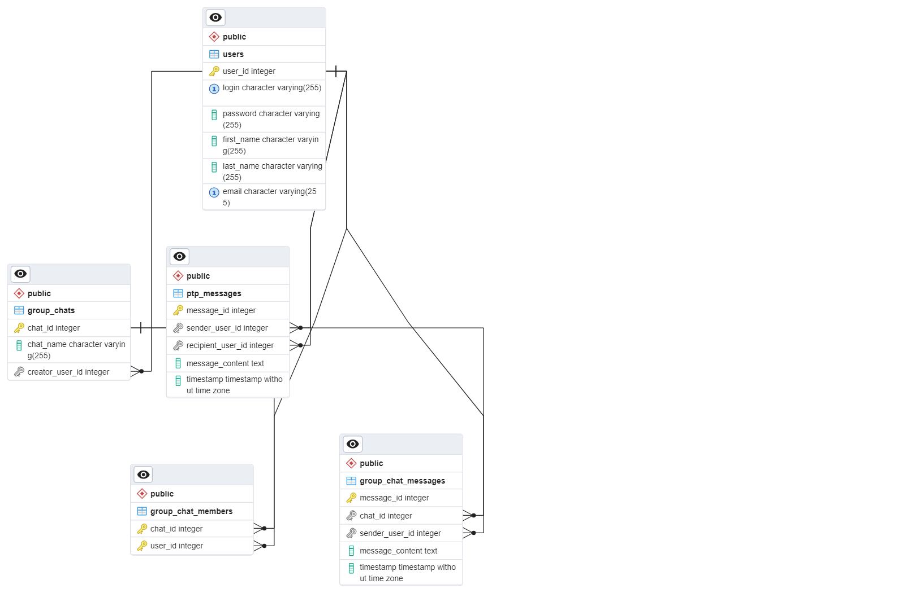

# Лабораторная работа №2

Вполнил: Стрыгин Д.Д.\
группа: М8О-111М-23\
вариант: 5

## Задание

Должны выполняться следующие условия:
-  Данные должны храниться в СУБД MariaDb;
-  Должны быть созданы таблицы для каждой сущности из вашего задания;
-  Интерфейс к сущностям должен предоставляться в соответствии со стилем REST;
-  API должен быть специфицирован в OpenAPI 3.0 (должен хранится в index.yaml);
-  Должен быть создан скрипт по созданию базы данных и таблиц, а также наполнению СУБД тестовыми значениями;
-  Для сущности, отвечающей за хранение данных о человеке (клиенте), должен быть реализован интерфейс поиска по маске фамилии и имени.

## Результаты

Для базы данных я спроектирвал такую схему (создал её в pgadmin, так как там привык к интерфейсу, заием в sql скрипт внёс правки для mariadb синтексиса)



Разработанные сервисы хранятся по пути
```
api/*
```
Файл тестирования лешит по пути
```
tests/test_api.py
```

## Выводы
Docker-compose предоставляет подходящий функционал для оркестрации контейнеров. Все написанные мною сервисы работают на fastapi, который предоствляет ASGI, то есть асинхронные запросы. Для каждого сервиса я написал тест по вставке занчений в базу данных mariadb, однако при попытке вставить уже существующую запись выпадет ошибка. SQLAlchemy - показала себя как очень достойный инструмент. Ранее я использовал её на проектах, где она не показывала соизмеримый результат и неё было много проблем, но с тех пор её функционал обновился и я нашёл для себя новый хороший инструмент
